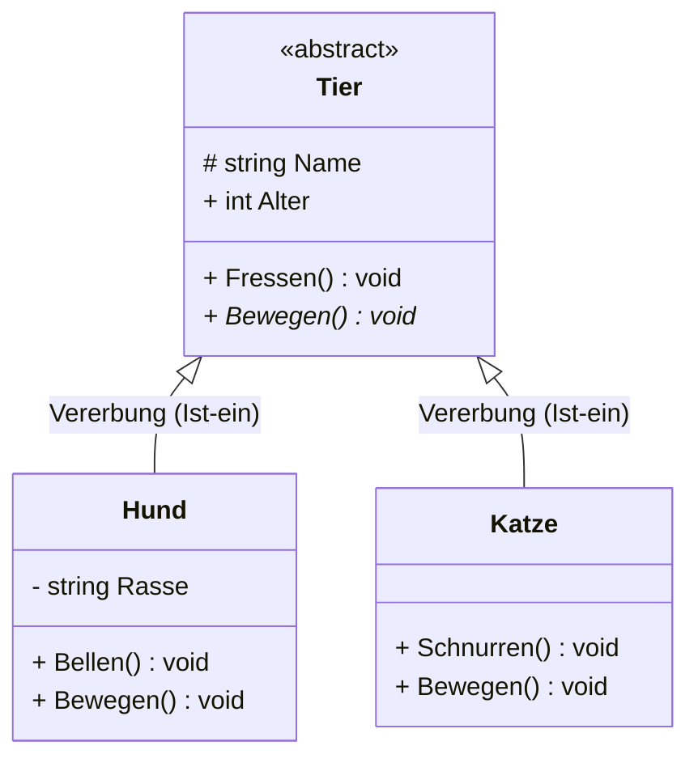
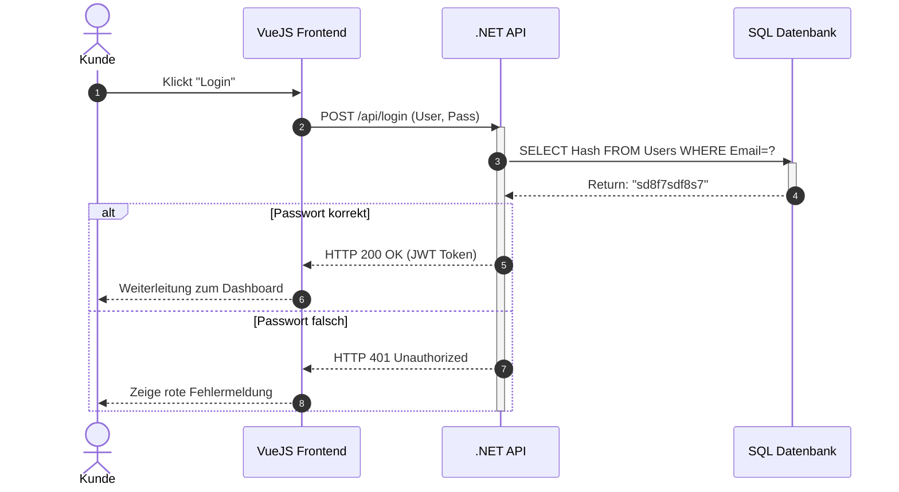
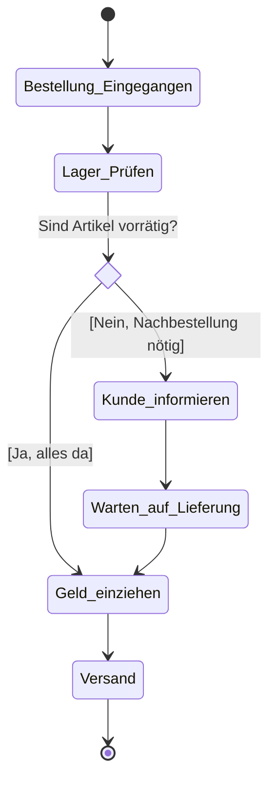

# 📊 UML Diagramme & Mermaid.js

  

UML (Unified Modeling Language) ist die Universalsprache der Softwareentwicklung. Ohne saubere UML-Diagramme wird dein betriebliches Abschlussprojekt von der IHK gnadenlos abgestraft. 

Statt mühsam mit der Maus in "Draw.io" Boxen zu schieben, nutzen moderne Entwickler **Mermaid.js**. Damit schreibst du logischen Code in Markdown-Dateien, aus dem automatisch Diagramme generiert werden! (GitHub, Notion und VS Code rendern das nativ).

---

## 📑 Inhaltsverzeichnis
1. [🏗️ Klassendiagramm (Struktur)](#-klassendiagramm-struktur)
2. [👤 Use-Case / Anwendungsfalldiagramm](#-use-case--anwendungsfalldiagramm)
3. [⏱️ Sequenzdiagramm (Ablauf)](#-sequenzdiagramm-ablauf)
4. [🔄 Aktivitätsdiagramm (Prozesse)](#-aktivitätsdiagramm-prozesse)

---

## 🏗️ Klassendiagramm (Struktur)

Das Klassendiagramm zeigt die Architektur deines Codes (Klassen, Attribute, Methoden und deren Beziehungen zueinander). Es ist ein **Strukturdiagramm** und fast schon Pflicht in jeder IHK-Dokumentation.

<details open>
<summary><b>Mermaid-Code & Vorschau</b></summary>

**Die Sichtbarkeits-Symbole (Modifiers):**
- `+` Public (Öffentlich)
- `-` Private (Gekapselt)
- `#` Protected (Nur für abgeleitete Klassen)

**Beispiel in Mermaid:** (Schreibe einfach drei Backticks ``` gefolgt von `mermaid` und füge den Code unten ein)



**Erklärung der Beziehungen:**
- `<|--` (Pfeil mit weißem Dreieck) = Vererbung (Inheritance).
- `*--` (Ausgefüllte Raute) = Komposition (Starke Abhängigkeit. Wenn das Gebäude gelöscht wird, werden auch seine Räume gelöscht).
- `o--` (Hohle Raute) = Aggregation (Schwache Abhängigkeit. Das Auto gehört einer Flotte an. Lösche ich die Flotte, existiert das Auto trotzdem weiter).
</details>

---

## 👤 Use-Case / Anwendungsfalldiagramm

Das klassische Diagramm für die Pflichtenheft-Phase oder die Anforderungsanalyse. Es zeigt *Wer* (Akteur) macht *Was* (Use Case) mit dem System, *ohne* den technischen Weg zu beschreiben.

<details open>
<summary><b>Mermaid-Code & Vorschau</b></summary>

```mermaid
usecaseDiagram
%% Mermaid unterstützt derzeit noch keinen nativen UseCase Syntax wie Klassendiagramme.
%% Wir nutzen Graphen (Flowcharts) als perfekten Workaround!

flowchart LR
    %% Akteure
    User((Kunde))
    Admin((Administrator))

    %% Systemgrenze
    subgraph Onlineshop System
        UC1(Artikel suchen)
        UC2(Warenkorb füllen)
        UC3(Bezahlen)
        UC4(Artikel anlegen)
    end

    %% Relationen
    User --> UC1
    User --> UC2
    User --> UC3
    Admin --> UC4
    
    %% Includes (Zwingend Teil von) und Extends (Optional Teil von)
    UC3 -.-> |include| Login(Einloggen)
    UC2 -.-> |extend| Gutschein(Gutschein einlösen)
```

**Erklärung:**
- Zylinder/Strichmännchen repräsentieren immer die handelnden Personen (Actors).
- **`<<include>>` (Muss):** Bedeutet "Zwingend erforderlich". Um zu *Bezahlen*, muss zwangsläufig der Schritt *Einloggen* durchlaufen werden.
- **`<<extend>>` (Kann):** Bedeutet "Optional Erweiterbar". Beim *Warenkorb füllen* KANN optional ein Gutschein eingelöst werden, das System funktioniert aber auch ohne.
</details>

---

## ⏱️ Sequenzdiagramm (Ablauf)

Ein reines **Verhaltensdiagramm**. Es zeigt exakt die zeitliche Abfolge von Methodenaufrufen. Es ist absolut fantastisch, um API-Aufrufe, Login-Prozesse (wie OAuth) oder Datenbank-Kommunikation darzustellen. Die Zeit verläuft von oben nach unten.

<details open>
<summary><b>Mermaid-Code & Vorschau</b></summary>



**Erklärung:**
- `->>` ist ein synchroner Aufruf (ich warte auf Antwort).
- `-->>` (gestrichelt) ist eine Rückantwort (Return / Response).
- `alt ... else ... end` ist eine "If/Else" Schleife in UML.
- `activate` erzeugt den dicken Aktions-Mittelstrich (Lebenszyklus), der zeigt, dass der Server gerade arbeitet und blockiert ist.
</details>

---

## 🔄 Aktivitätsdiagramm (Prozesse)

Perfekt, um hochkomplexe Algorithmen oder fachliche Prozesse (Kaufabwicklung, Retourenmanagement) wie einen klassischen Programm-Ablaufplan darzustellen.

<details open>
<summary><b>Mermaid-Code & Vorschau</b></summary>



**Erklärung:**
- `[*]` ist Start und Ende.
- `<<choice>>` generiert eine Raute (Verzweigung/If-Abfrage).
- Text in `[Option A]` sind die sogenannten "Guards" (Bedingungen, die wahr sein müssen, damit dieser Pfad abgelaufen wird).
</details>

---
[Zurück zur Übersicht](../README.md)
